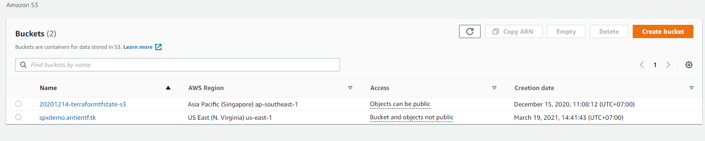

IF YOU WANT TO USE REMOTE BACKEND UNCOMMENT FILE backend.tf

``` ssh keygen -f ``` to generate public key and private key to connect to instance

And make sure you had a bucket name for cloudfront cdn
you can change default on variable "bucket_name" like this

```
variable "bucket_name" {
  description = "The name of the bucket. If omitted, Terraform will assign a random, unique name. Must be less than or equal to 63 characters in length"
  type        = string
  default = "spxdemo.antientf.tk" // you can change this line
}

```



```terraform init```: Used to initialize a working directory containing Terraform configuration files. This is the first command that should be run after writing a new Terraform configuration or cloning an existing one from version control. It is safe to run this command multiple times.

```terraform plan```: Used to create an execution plan. Terraform performs a refresh, unless explicitly disabled, and then determines what actions are necessary to achieve the desired state specified in the configuration files.

```terraform apply```: Used to apply the changes required to reach the desired state of the configuration, or the pre-determined set of actions generated by a terraform plan execution plan.

```terraform destroy```: Used to destroy the Terraform-managed infrastructure.


